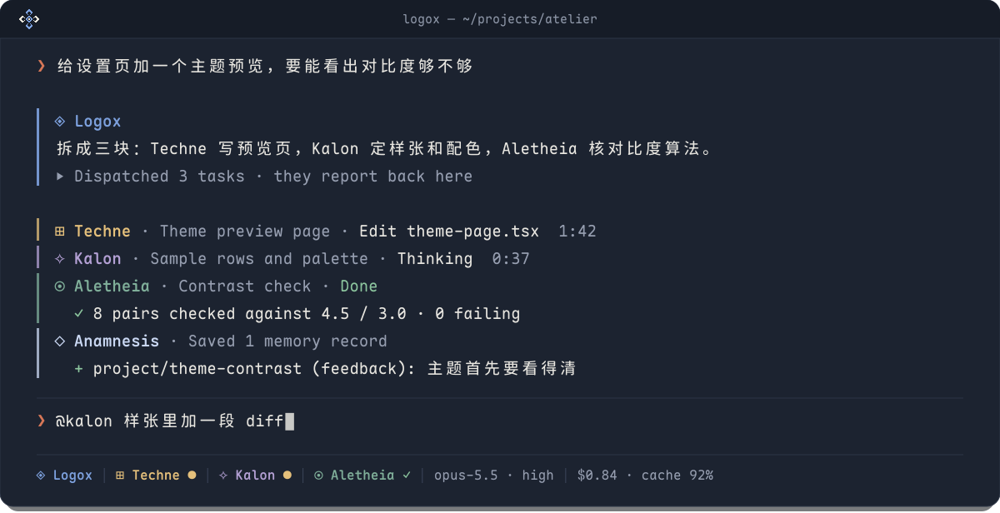

<p align="center">
  <picture>
    <source media="(prefers-color-scheme: light)" srcset="assets/banner-light.svg">
    
  </picture>
</p>

<p align="center">
  <b>多模型协同的终端编程助手</b>：主控拆解需求，专职角色并行实现、设计与审查，上下文与记忆自动沉淀。
</p>

<p align="center">
  <a href="https://www.npmjs.com/package/@kurios/logox"></a>
  <a href="https://nodejs.org"></a>
  
  <a href="LICENSE"></a>
</p>

<p align="center">
  <a href="#快速上手">快速上手</a> ·
  <a href="docs/USAGE.md">使用手册</a> ·
  <a href="docs/UI-SPEC.md">终端操作</a> ·
  <a href="docs/COLORS.md">主题</a> ·
  <a href="#参与开发">参与开发</a>
</p>

<p align="center">
  
</p>

## 为什么是多角色协作

大多数编程助手以单线程对话包办所有环节。Logox 内置了一组职责明确、上下文独立的常驻角色：**Logox** 负责理解需求、直接处理简单问题，或将复杂任务拆解给对应角色；各角色之间可以直接通信协作，并在完成后汇总结果、核验交付。

终端界面会为每个角色展示一张实时状态卡片，显示当前工具调用、推理状态与耗时。需要直接指定某个角色处理时，可输入 `@techne 重构这个函数`，或双击底部状态条进入它的独立视图。

## 角色分工

| | 角色 | 职责 |
| :--- | :--- | :--- |
| `◈` | **Logox** · 主控 | 需求理解、任务拆解、进度协调与结果验收 |
| `⊞` | **Techne** · 工程实现 | 架构设计、代码重构与测试编写；先落地可运行版本再逐步完善 |
| `✧` | **Kalon** · 界面与视觉 | 前端界面、交互节奏、SVG 与排版配色、文案打磨 |
| `◎` | **Aletheia** · 审查与排错 | 调用链追踪、根因分析、独立代码审查与影响面评估 |
| `◇` | **Anamnesis** · 上下文记忆 | 会话空闲时生成进度摘要，提炼长期偏好与项目约定 |

此外还提供 **Automa** 无状态并行执行器，任何角色都可以派发批量、独立的子任务给它处理，且权限范围只收窄不放大。每个角色都支持单独配置模型与思考强度，详细机制见 [docs/modules/actors.md](docs/modules/actors.md)。

## 亮点

**协作**
- **并行而不冲突**：同一文件的写入自动排队；基于过期读取内容的覆盖会被拦下，并提示由哪个角色先做了修改。
- **任务有界且可追溯**：主控派发的每项任务都带有职责范围与验收标准，回执中附带真实运行时记录（修改了哪些文件、执行了哪些命令）。
- **不设硬性轮次上限**：任务持续推进直到完成，或由你按 `Esc` / `Ctrl+C` 中止；出现停滞循环时由运行时检测提醒，而非直接截断。

**记忆**
- **会话恢复摘要**：会话空闲几分钟后，Anamnesis 会生成一张包含当前进度、未完成项与下一步计划的摘要卡片，方便中断后接续。
- **跨会话长期记忆**：空闲更久时，它会回顾对话，将使用偏好、纠正过的做法和项目约定存为 Markdown 记录（`.logox/memory/` 与 `~/.logox/memory/`），新会话启动时各角色可直接读取；你也可以随时说"记住……"。
- 通过 `/anamnesis` 可手动触发回顾与记忆整理、浏览或删除历史记录，或为其单独换一个更轻量的模型。

**可见与可控**
- **花了多少一目了然**：`/usage` 按角色、模型和类别列出费用与 token（含缓存命中），以及订阅额度。
- **三档权限**：`default` 逐项审批、`auto` 由审查模型代为判断、`creative` 放开开发权限；规则可按项目或全局保存。
- **改错了能撤回**：`/undo` 撤销最近一轮的文件改动，`/rewind` 回退到任意一轮。
- **每个角色一个浏览器**：做网页和界面时，各角色用自己独立的 Playwright 实例操作、检查和截图。

**终端体验**
- **全程支持鼠标**：每个页面都能点击、悬停和滚轮，不只是键盘。
- **主题可预览**：`/theme` 打开实时预览页，每个主题都会做一遍可读性检查（WCAG 对比度与易混色），看得清是第一位的。

## 快速上手

需要 Node.js 22 或更高版本。

```bash
npm install -g @kurios/logox
logox
```

首次启动没有可用模型时，会自动打开设置向导。想先看看效果，不需要任何 API Key：

```bash
npx @kurios/logox --demo   # 离线演示多角色并行协作界面
```

行为异常时先运行 `logox --doctor`，它会检查 Node 版本、终端能力、ripgrep、Playwright、角色配置和模型凭据，并告诉你缺什么。

## 接入模型

输入 `/login`，先选登录方式：

- **API key**：DeepSeek、OpenAI、Anthropic，或任意 OpenAI 兼容的自定义地址（Ollama、LM Studio、vLLM、本地代理等）。
- **Account sign-in**：用账号登录，目前支持 OpenAI 账号。

登录后用 `/model` 选择模型，`/effort` 调整思考强度；`/model techne <模型> high` 可以给单个角色指定模型和强度。

也可以不进向导：启动目录下的 `.env`（`DEEPSEEK_API_KEY`、`OPENAI_API_KEY`、`ANTHROPIC_API_KEY`）会被自动读取；或者在 `~/.logox/config.toml`、项目内的 `.logox/config.toml` 里声明服务：

```toml
[providers.local]
kind = "openai_compat"
base_url = "http://127.0.0.1:11434/v1"
default_model = "qwen2.5-coder:32b"

[provider]
name = "local"
```

完整示例见 [config.example.toml](config.example.toml)，加载顺序和全部选项见[使用手册](docs/USAGE.md)。

## 终端与字体

请使用支持真彩色的终端（Windows Terminal、iTerm2、Ghostty、WezTerm、Alacritty 等），并把字体设为带 Nerd Font 字形的等宽字体。推荐 [Maple Mono NF CN](https://github.com/subframe7536/maple-font/releases)，中英文与图标一款覆盖；也可以用 [JetBrainsMono Nerd Font](https://www.nerdfonts.com/font-downloads)。没有 Nerd Font 时，状态栏的部分字形会显示为方块。

## 常用命令

| 命令或按键 | 作用 |
| :--- | :--- |
| `/login` · `/model` · `/effort` | 连接模型服务，切换模型与思考强度 |
| `/ensemble` | 每位角色一页：模型、上下文、工具、技能、本会话的用量 |
| `/anamnesis` | 回顾与记忆：立即运行、浏览记忆、选择模型 |
| `/usage` · `/status` | 费用与 token 明细；模型、权限与会话状态 |
| `/theme` · `/settings` | 主题预览；外观、状态栏与快捷键 |
| `/undo` · `/rewind` · `/resume` | 撤销改动、回退到某一轮、接续历史会话 |
| `@角色名 <任务>` | 直接把任务交给某位角色 |
| `Enter` / `Shift+Enter` | 提交 / 换行 |
| `Ctrl+G` | 在主视图与各角色窗口之间切换 |
| `Esc` | 返回主视图，或中止当前任务 |

全部命令见[使用手册](docs/USAGE.md)，快捷键与鼠标操作见[终端操作](docs/UI-SPEC.md)。

## 文档

- [文档导航](docs/README.md)
- [使用手册](docs/USAGE.md)：配置、模型服务、会话、权限、命令
- [终端操作](docs/UI-SPEC.md)：快捷键、鼠标、面板
- [主题与配色](docs/COLORS.md) · [品牌规范](docs/BRAND.md)
- [模块说明](docs/modules/README.md)：面向开发者的实现说明

## 参与开发

```bash
git clone https://github.com/MARKIR123/Logox.git
cd Logox
npm ci --ignore-scripts
npm run build && npm start   # 从源码运行
npm run check                # 类型检查与文档校验
npm test                     # 文档校验、构建并运行全部测试
```

需要浏览器自动化时，联网执行一次 `npm run browser:install` 安装 Chromium。代码导航从 [AGENTS.md](AGENTS.md) 开始：每个子系统都有自己的路标文件，写明入口、常见改法和不能越过的边界。

## 名字

λόγος 意为理性、言说与条理。Logox 希望做的事很简单：让不同特长的模型在终端里有分工地把问题分析清楚、把代码写扎实。

## 许可

[MIT](LICENSE)
